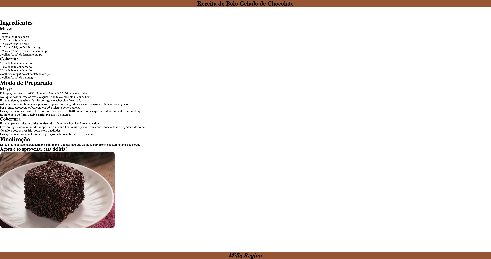

# RECEITA

## Projeto

Página de receita de bolo de chocolate criada durante as aulas da disciplina Linguagem de Marcação no curso da escola SENAI Jandira.

## Tecnologias

* HTML
* CSS
* GIT

## Autor

[Milla Regina](https://www.linkedin.com/in/MillaRegina)